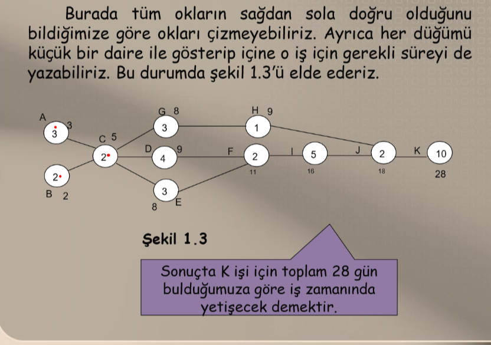
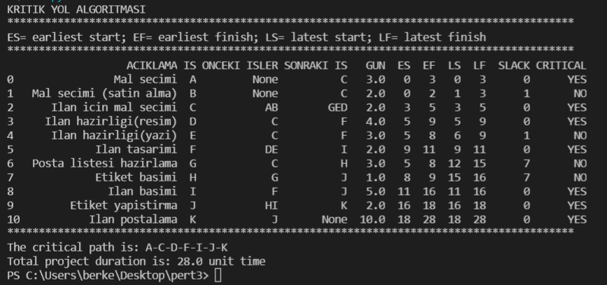

# Pert-Algoritmasi
Kritik Yol Metodu(CPM) bir proje planındaki, projenin bitiş tarihinde tamamlanması için zamanında tamamlanması gereken en uzun aktivite dizisidir.

Şekildeki iş akışında gösterilen bilgileri actdata.ods adındaki excel dosyasına yazıyoruz. Ardından bu excel dosyasına göre en uzun yolu ve maksimum iş gününü öğrenmeye çalışıyoruz.

Sonuçta maksimum 28 gün sürecek olan işin CPM' e göre en uzun yol A-C-D-F-I-J-K  yolu olacaktır.

**Burada kullanılan kısaltmalar ve anlamları:**

Duration: işi gerçekleştirmek için gereken tahmini süre

PREDECESSORS: Önceki işler

SUCCESSORS: Sonraki işler

Earliest start: işin başlayacağı en erken başlangıç süresi. İş en erken bu tarihte başlar.

Earliest finish: işin bitebileceği en geç bitiş süresi. iş en erken bu tarihte bitebilir. EF = ES + D

Latest start: iş en geç bu tarihte biter. Bu tarihten daha geç başlayamaz.

Latest finish: iş en geç son bitiş tarihinde bitebilir. Bu tarihten daha geç bitemez.

Slack: Ekstra zaman. Eğer 0 çıkarsa critical yes olur. Çünkü bundan daha fazla gün çıkabilecek bir ihtimal yok. 0 ın dışında çıkarsa da ondan daha uzun sürecek bi ihtimal olduğu için o düğüm seçilmez. Kısaca formül olarak-> LS-ES yapıyoruz.

ES: işin başlayabileceği en erken tarih A ve B 0 olur. C en erken 3. günde başlar. G D ve E en erken 5. gün başlar. F en erken 9. günde başlar. H en erken 8. günde başlar şeklinde.

LF: Dönüşte o düğüme gidilebilcek en uzun yol. O işin bitebileceği en son tarih. Örneğin G için 28-10-2-1 = 15 

LS: LF - D     Bu işin başlayabileceği en son tarih. Örneğin G nin LS'si 15-3 = 12 
